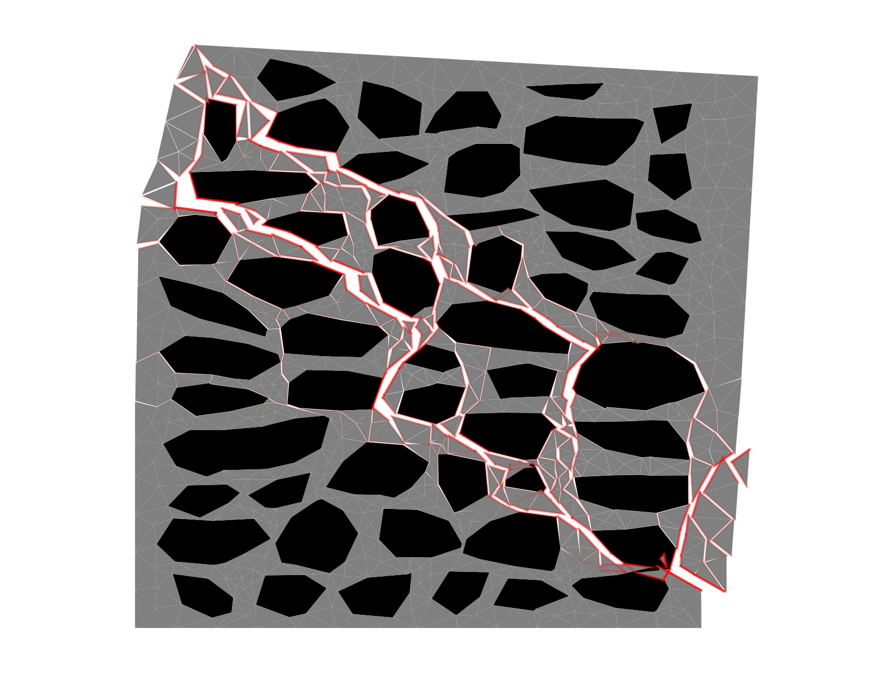

# Stone Wall Analysis Toolkit

## Overview

This repository provides workflows for analyzing masonry walls under shear-compression loading using limit analysis and pushover analysis. Models are derived from binary images of wall structures.

The modeling method is optimization-based rigid block modeling. Please refer to these publications for detailed explanation:

    Wang, Q., dos Santos, K. R., & Beyer, K. (2025). Geometric planning for masonry wall construction with natural stones using discrete convolution. Engineering Structures, 329, 119695.

    Wang, Q., Haindl, M., dos Santos, K. R., & Beyer, K. (2024). Applying a 2D variational rigid block modeling method to rubble stone masonry walls considering uncertainty in material properties. International Journal of Architectural Heritage, 1-23.

The image below illustrates an example output of the limit analysis:


## Table of Contents

- [Environment Setup](#environment-setup)
- [Limit Analysis Workflow](#limit-analysis-workflow)

  - [Config Parameters](#config-file-parameters-limit-analysis)

- [Pushover Analysis Workflow](#pushover-analysis-workflow)

  - [Config Parameters](#config-file-parameters-pushover-analysis)

- [Examples](#examples)
- [Citation](#citation)
- [Contact](#contact)

---

## Environment Setup

Tested on **Ubuntu 20.04.6 LTS**.

### Step 1: Build Virtual Environment

```bash
python -m venv ./venv/
source ./venv/bin/activate
```

### Step 2: Configure Virtual Environment

```bash
cd path/to/source
python setup.py install
pip install -r requirements.txt
```

### Step 3: Obtain MOSEK License

Free academic and trial licenses are available at [MOSEK](https://www.mosek.com).

---

## Limit Analysis Workflow

**Directory**: `Workflows/LA_2D_image`

### Step 1: Understand the Input Files

The input for an example analysis is in `Workflows/LA_2D_image/data`

- **Binary wall image**: Stones in white, mortar in black.
- **`config.json`**: Contains geometry, material properties, boundary conditions, and plotting parameters.

#### Config File Parameters Limit Analysis

**Geometry Parameters:**

- `scale_img_to_height`, `scale_img_to_width`, `wall_thickness`: Wall dimensions in mm (height = vertical, width = horizontal, thickness = out-of-plane).
- `point_grid_size`: Integer controlling shape simplification during edge detection. Higher = more simplification. Min = 1.
- `mesh_size`: Integer for mortar discretization mesh size.

**Material Parameters:**

- Mortar properties:

  - `mortar_mortar_fc`: Compressive strength (MPa)
  - `mortar_mortar_ft`: Tensile strength (MPa)
  - `mortar_mortar_cohesion`: Cohesion (MPa)
  - `mortar_mortar_mu`: Friction coefficient

- Stone–mortar interface:

  - `mortar_stone_fc`, `mortar_stone_ft`, `mortar_stone_cohesion`, `mortar_stone_mu`: Same properties as above

- Ground/Beam interface:

  - `ground_beam_fc`, `ground_beam_ft`, `ground_beam_cohesion`, `ground_beam_mu`: Usually set to high values to prevent failure at these interfaces

- Density:

  - `unit_density`, `mortar_density`: Density of stone and mortar (kg/m³)

**Boundary Conditions:**

- `boundary`: Type of loading condition (`"cantilever"` or `"double_bending"`)
- `vload`: Vertical axial load (MPa)
- `hload_direction`: Direction of horizontal load (`1` or `-1`)

**Plot Parameters:**

- `plot_max_disp`: Max displacement in mm when plotting the failure mode

### Step 2: Generate Rigid Block Model

```bash
python 01_generate_model.py -i ./data -r ./result
```

- `-i`: Directory with wall image and config file
- `-r`: Output directory for results

### Step 3: Run Limit Analysis

```bash
python 02_run_limit_analysis.py -i ./data -r ./result
```

### Step 4: Plot Failure Mechanism

```bash
python 03_plot_failure_mode.py -i ./data -r ./result
```

### Step 5: Review Results

- **Max Load**: `./result/***/run_limit_analysis/load_multiplier.txt` (last column, MPa)
- **Failure Mode**: `./result/***/run_limit_analysis/***/displacement.png`
- **Discretization Visualization**: Open `./result/***/kmodel/mortar.msh` in ParaView

---

## Pushover Analysis Workflow

**Directory**: `Workflows/PO_2D_image`

### Step 1: Understand the Input Files

The input for an example analysis is in `Workflows/PO_2D_image/data`

- Same binary wall image and geometry/material/boundary parameters as the limit analysis.
- Additional pushover-specific parameters in `config.json`.

#### Config File Parameters Pushover Analysis

**Pushover-Specific Material Parameters:**

- `crack_gap`: Gap threshold (m) to zero tensile strength and cohesion
- `E_stone`, `E_mortar`: Young's modulus for stone and mortar
- `Poisson_stone`, `Poisson_mortar`: Poisson's ratio for stone and mortar

**Pushover Protocol Parameters:**

- `force_step`: Load increment in pre-peak phase (kN)
- `disp_step`: Displacement step in post-peak phase (m)
- `max_iterations_pushover`: Max analysis steps
- `element_id_control`: ID of element controlling post-peak displacement, or `false` to use beam element

See [configuration for limit analysis](#config-file-parameters-limit-analysis) for other parameters.

### Step 2: Generate Rigid Block Model

```bash
python 01_generate_model.py -i ./data -r ./result
```

### Step 3: Run Pushover Analysis

```bash
python 02_run_pushover.py -i ./data -r ./result
```

### Step 4: Plot Pushover Curve

```bash
python 03_plot_pushover_curve.py -i ./data -r ./result
```

### Step 5: Review Results

- **Deformed Models (Each Step)**: `./result/***/run_pushover/***/sample0/`
- **Force–Displacement Curve**: Located in result directory
- **Discretization Visualization**: Open `./result/***/kmodel/mortar.msh` in ParaView

---

## Examples

- Additional examples for limit analysis are in `./LA_2D_image/examples`.
- Additional examples for pushover analysis are in `./PO_2D_image/examples`.

---

## Citation

If you use this toolkit in your research or publications, please cite the following papers:

    Wang, Q., Haindl, M., dos Santos, K. R., & Beyer, K. (2024). Applying a 2D variational rigid block modeling method to rubble stone masonry walls considering uncertainty in material properties. International Journal of Architectural Heritage, 1-23.

## Contact

For questions, feedback, or collaboration inquiries, please contact:

**Qianqing Wang** at [Earthquake Engineering and Structural Dynamics (EESD)](https://www.epfl.ch/labs/eesd/)

📧 Email: \[[qianqing.wang@epfl.ch](mailto:qianqing.wang@epfl.ch)]
